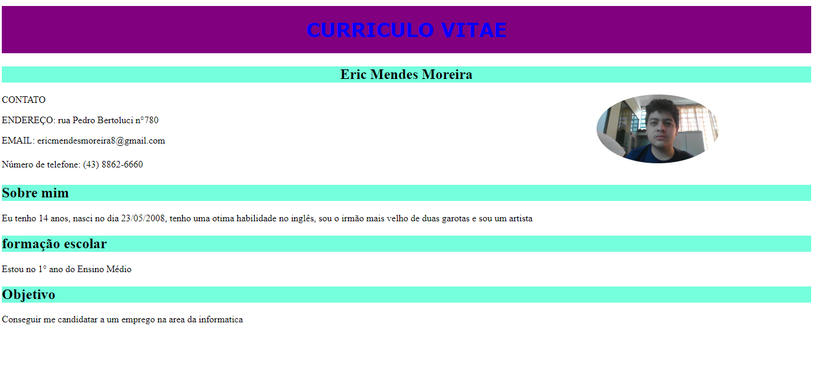

# Índice
Meu currículo
## Sobre mim
Meu nome é Eric Mendes Moreira e tenho 15 anos 

## Minhas habilidades
Tenho facilidade na língua inglesa, e tenho habilidades consideraveis na progrmação
## Meus sonhos
Ter sucesso com programação e ter um emprego que agregue para a minha vida

## Curiosidades minhas

Sou irmão mais velho de duas irmãs, nasci no dia 23 de maio de 2008,
estudo no Marista escolas sociais e estou criando um jogo próprio.

## Tecnologias utilizadas
* `HTML5`
* `CSS3` 
* `Git`
* `Github`

## Ferramentas utilizadas 
* `VScode` 

## Matérias utilizadas para a produção do curriculo
Fundamentos de Desenvolvimento Web: 
Professor [Leonardo](https://github.com/leonardorochamarista) 
Lingua portuguesa 
Interioridades 
